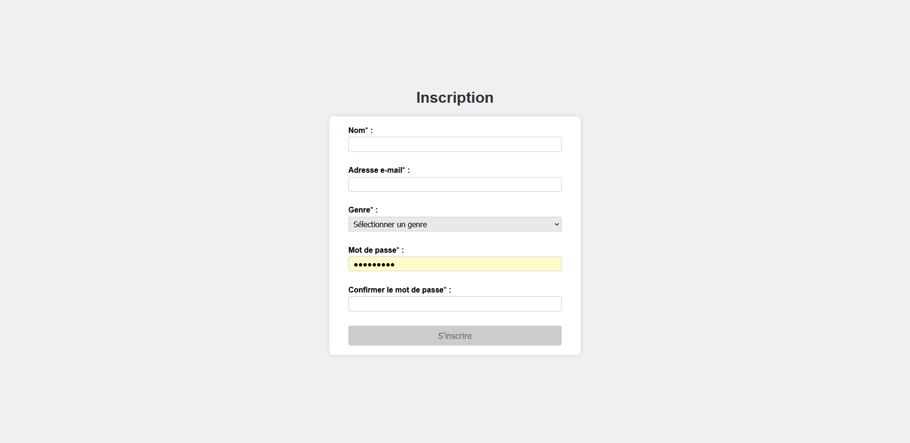
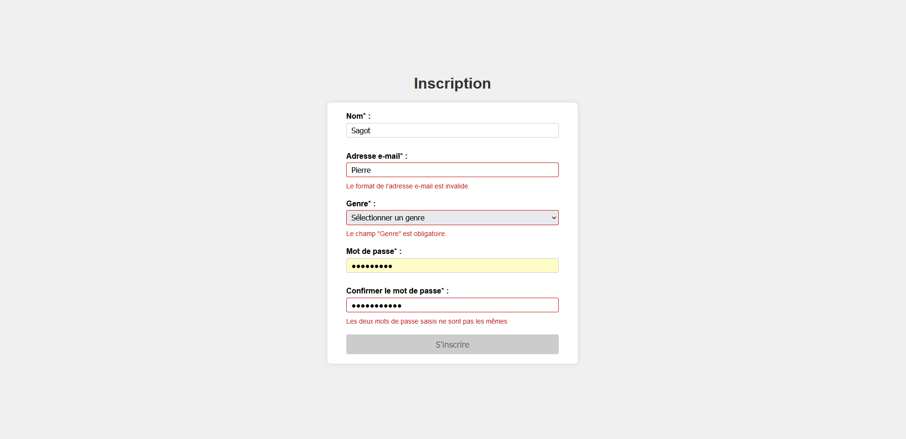

# Projet : Validation de formulaire

## Introduction
Dans le cadre de cet exercice, nous allons développer un petit formulaire html genre formulaire d'inscription, récoltant le nom, l'adresse e-mail, le genre et un mot de passe.
(*voir capture d'écran ci-dessous*)

Lors de la saisie, on vérifie que les champs sont correctement remplis et on affiche un message d'erreur si ce n'est pas le cas.
(*voir capture d'écran ci-dessous*)

on vérifiera que
- le nom est composé d'au moins 2 caractères
- l'adresse e-mail est valide (contient un seul `@` et au moins un `.`, pas d'espace)
- le genre est bien sélectionné
- le mot de passe est composé d'au moins 8 caractères

Le bouton `S'inscrire` est désactivé tant que tous les champs ne sont pas correctement remplis (propriété `disabled`).

## Objectifs
- [x] Créer un formulaire html
- [x] Créer un fichier de style css
- [x] Créer un fichier de script javascript
- [x] Vérifier que les champs sont correctement remplis
- [x] Afficher un message d'erreur si ce n'est pas le cas
- [x] Activer le bouton `S'inscrire` si tous les champs sont correctement remplis

## Hints
- [x] Utiliser les expressions régulières pour valider les champs
- [x] Utiliser la méthode `test()` de l'objet `RegExp` pour valider les champs
- [x] Utiliser la méthode `addEventListener()` pour gérer les événements